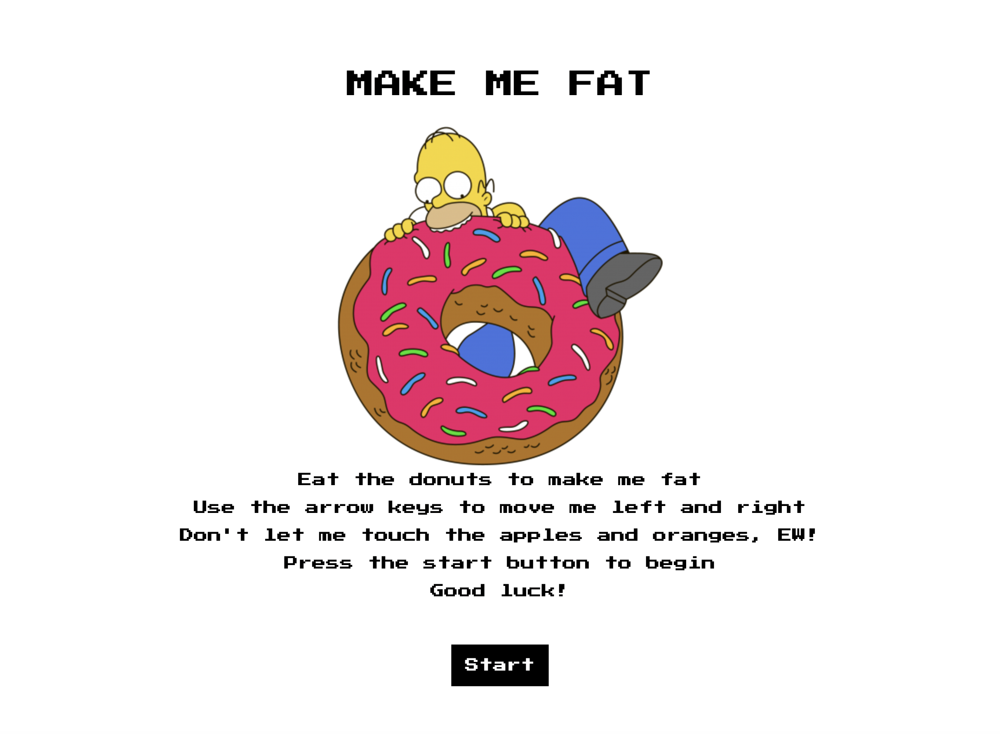
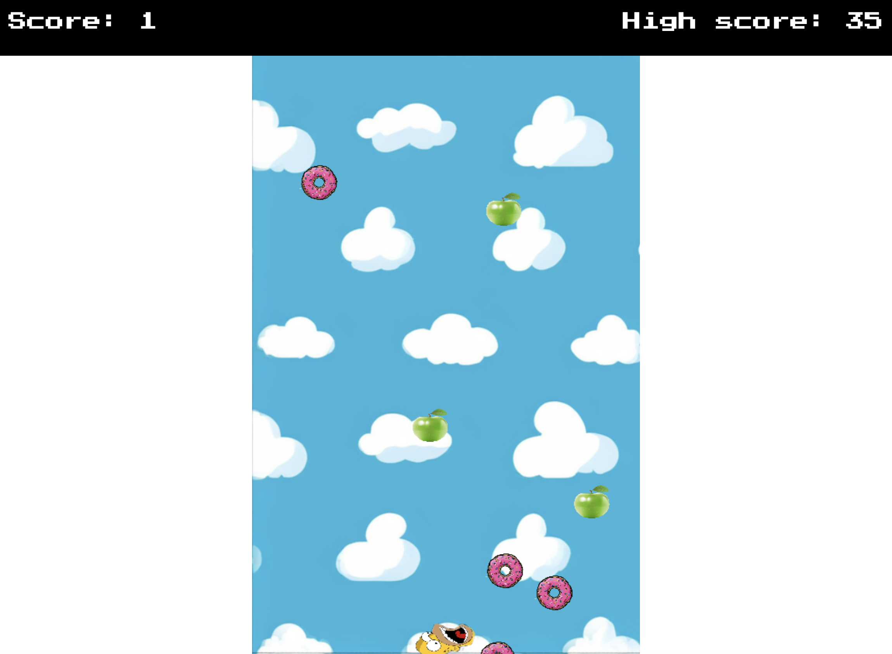

# HomerEatingDonuts

## Table of Contents
- [Description](#description)
- [Requirements](#requirements)
- [Installation](#installation)
- [Usage](#usage)
- [Screenshots](#screenshots)

## Description
This is a game coded using javascript canvas and html. The game is about Homer Simpson eating donuts. The game is simple, you have to move Homer to eat the donuts that are falling from the sky. If you eat a donut you get a point, if you eat a fruit the game is over. The game has a start screen and a game over screen.

## Requirements
- Node.js

## Installation
1. Clone the repository
2. Run live server on the index.html file

## Usage
1. Press the start button
2. Move Homer using the arrow keys left and right
3. Eat the donuts and avoid the fruits
4. If you eat a fruit the game is over
5. If you eat a donut you get a point
6. Press the restart button to play again

## Screenshots

Happy playing! 🍩
